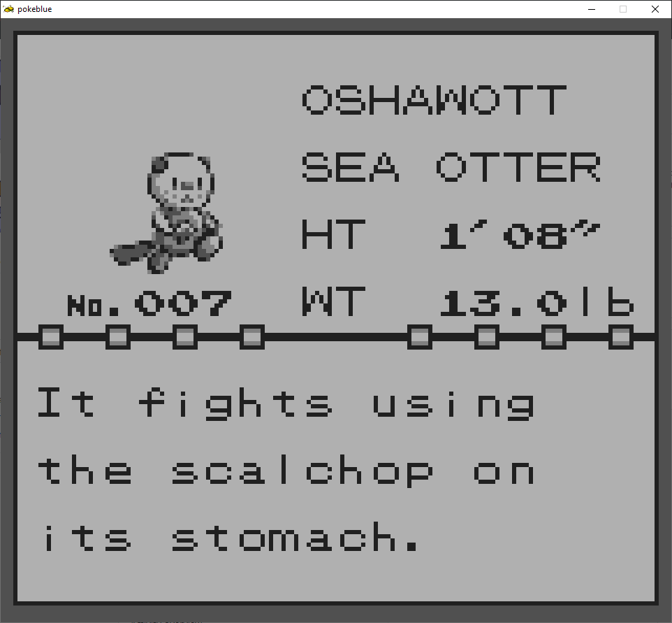
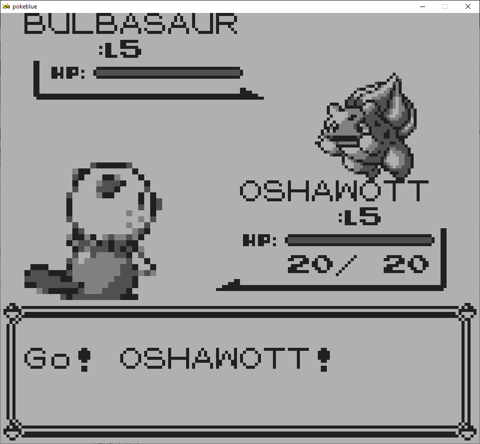

# Pokémon Red and Blue: Oshawott Edition
This is a ROM hack (Well, kinda) of Pokemon Red and Blue where you can pick Oshawott as your starter at the beginning of the game!

To compile and play it, follow the instructions in [**INSTALL.md**](INSTALL.md)!

## Isn't this a ROM hack?
It probably is! But it also isn't one in the traditional sense, since I'm never actually touching any ROMs, or any patch files to use on ROMs. It's actually a modification of the extremely rad Pokemon Red and Blue disassemblies by [pret][pret]; the Pokemon Reverse Engineering Team.

All my project here really is, are modifications to the extremely clean disassembly data that they made. And because I'm never actually touching any ROMs, I don't really know what to call a modification from a project like this.

# Disclaimer
I can't, for legal reasons, distribute built ROMs containing copyrighted content in it, so any binary builds requested will need to instead be patch files containing the changes needed to add my own fanart and modifications to the base game (that you'll need to apply yourself with a patching program).

No part of this repository contains data files obtained from the original development tree of the game.

[pret]: https://github.com/pret
